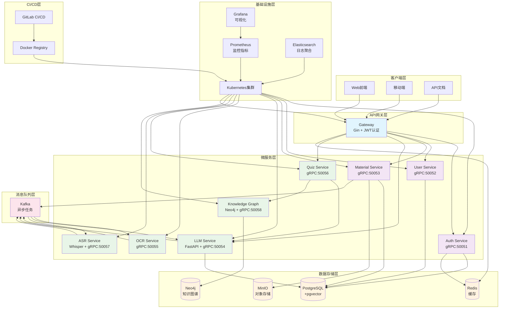
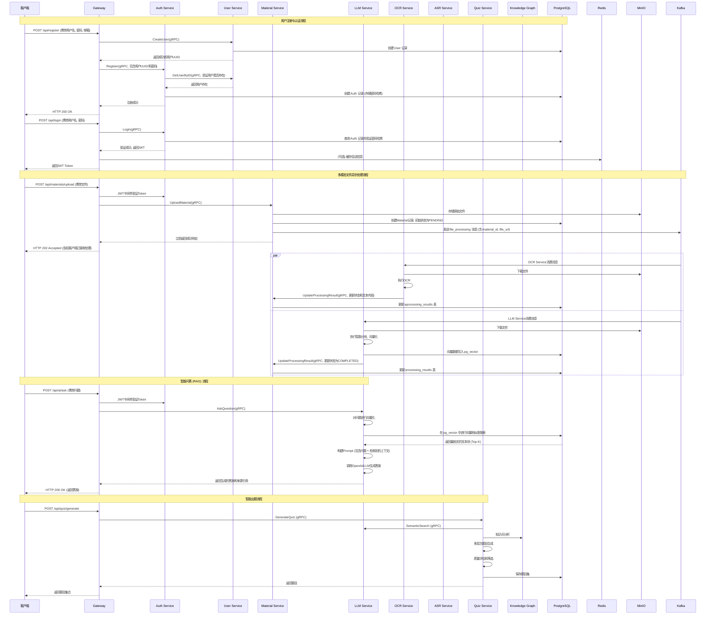
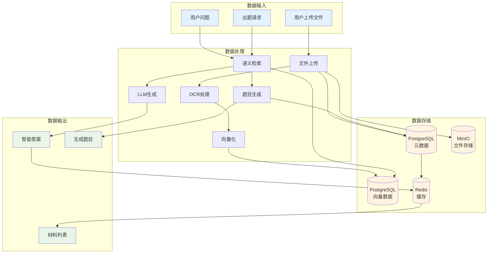
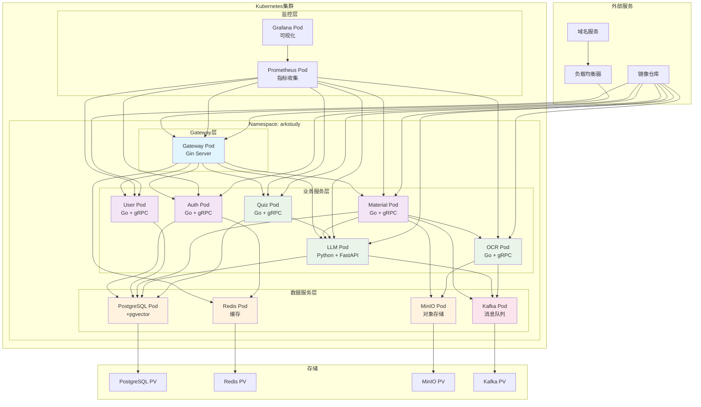
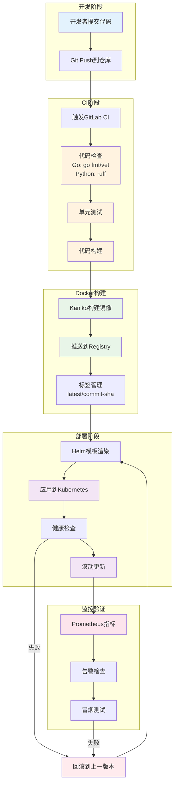

# ArkStudy 系统架构分析与流程图

## 1. 整体系统架构图

## 2. 完整业务流程图

## 3. 数据流向图

## 4. 部署架构图

## 5. CI/CD流程图

## 6. 技术栈总览

### 后端技术栈
- **主要语言**: Go 1.22, Python 3.13
- **Web框架**: Gin (Go), FastAPI (Python)
- **RPC框架**: gRPC + Protocol Buffers
- **ORM**: GORM (Go), SQLAlchemy (Python)
- **认证**: JWT Token

### 数据存储技术栈
- **关系数据库**: PostgreSQL 16 + pgvector扩展
- **缓存**: Redis
- **对象存储**: MinIO (S3兼容)
- **消息队列**: Apache Kafka

### 容器化与编排
- **容器**: Docker
- **编排**: Kubernetes
- **配置管理**: Helm Charts
- **服务发现**: Kubernetes DNS

### DevOps工具链
- **CI/CD**: GitLab CI/CD
- **镜像构建**: Kaniko
- **监控**: Prometheus + Grafana (规划)
- **日志**: 结构化日志 (logrus, Python logging)

### AI/ML技术栈
- **LLM接口**: OpenAI兼容API，支持多种大模型
- **语音识别**: Whisper large-v3模型，支持多语言
- **文档识别**: PaddleOCR高精度识别引擎  
- **向量检索**: pgvector + HNSW索引算法
- **知识图谱**: Neo4j图数据库 + NLP实体关系抽取
- **智能出题**: 基于认知层次的多维度质量控制
- **MCP协议**: 模型上下文协议，支持AI工具协作
- **异步处理**: Kafka消息队列驱动的处理流水线

这个架构图清晰地展示了您的项目的技术复杂度和工程化水平，为面试提供了强有力的可视化支撑。